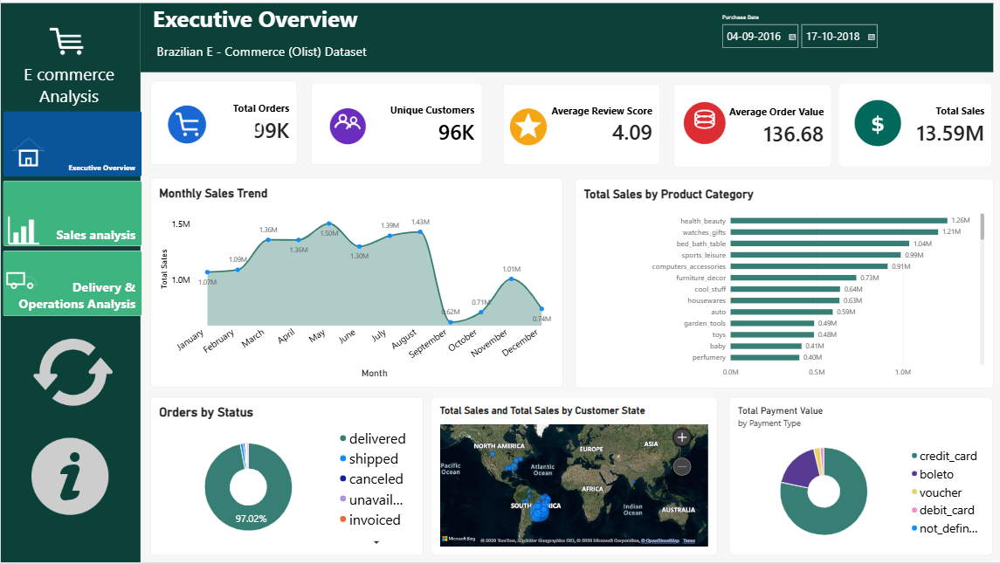

# Brazilian E-Commerce Power BI Analytics

## 📊 Project Overview

This project analyzes the Brazilian E-Commerce Public Dataset by Olist using Microsoft Power BI.

The project focuses on sales performance, customer behavior, product categories, payment methods, customer reviews, and delivery operations.

## 🎯 Objectives

- Analyze sales performance
- Understand customer behavior
- Analyze product categories
- Analyze payment methods
- Evaluate delivery performance
- Identify business insights

## 📁 Dataset

**Dataset:** Brazilian E-Commerce Public Dataset by Olist  
**Source:** Kaggle  
**Country:** Brazil  
**Period:** September 2016 – October 2018

## 🛠️ Tools Used

- Power BI
- Power Query
- DAX
- Data Modeling
- Data Visualization

## 📊 Dashboard

### Executive Overview

### Sales Analysis

### Delivery & Operations Analysis

## 📌 Key KPIs

| KPI | Value |
|---|---:|
| Total Sales | 13.59M |
| Total Orders | 99K |
| Unique Customers | 96K |
| Average Order Value | 136.68 |
| Average Review Score | 4.09 |
| Late Delivery Rate | ~8% |

## 💡 Key Insights

- Approximately 99K orders were analyzed.
- Approximately 96K unique customers were identified.
- Total sales were approximately 13.59M.
- Health & Beauty is one of the strongest categories.
- São Paulo contributes the largest share of sales.
- Credit card is the dominant payment method.
- Most orders were delivered on time.
- Approximately 8K delivered orders were identified as late.

## 🚀 Future Scope

- Sales forecasting
- Customer segmentation
- Seller performance analysis
- Product profitability analysis
- Predictive late-delivery analysis
- Power BI Service deployment
- Scheduled data refresh
- 
## Power BI File

The complete Power BI `.pbix` file is available here:

[Download Power BI File](https://drive.google.com/file/d/1sS0MfqehNw9EousyS02Lg-r3cg3PzgCC/view?usp=sharing)

## 👨‍💻 Author

**Gishal S**

B.Tech Computer Science Graduate  
Data Analytics / Power BI
